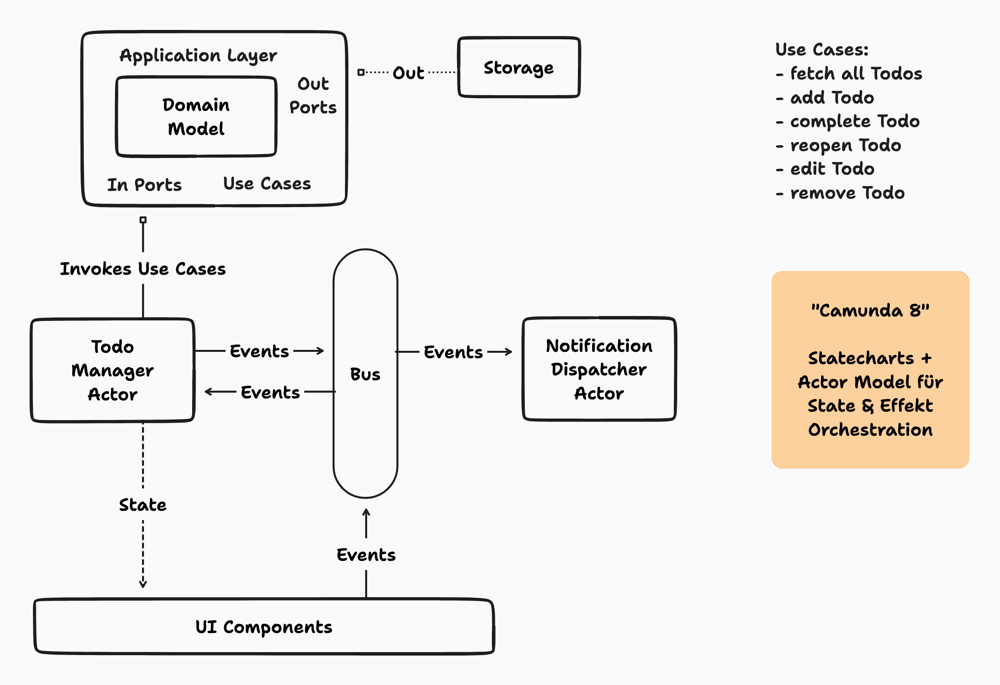

# Todo Ports

Proof of concept for a hexagonal architecture. Use cases are orchestrated and
driven by Statecharts, which are organized in an actor system.

## Getting Started

> Common Vite application with no surprises. Have Node LTS and run `npm run dev`
> for development.

## Architecture

This repo contains two possible implementations for the use-cases:

The first one found on the `main` branch contains rather slim use-cases that
should be reusable in a UI-client as well as REST api.

The second version found on the `bigger-use-cases` branch moves more logic, i.e.
triggering notifications and requesting confirmation, into the use-cases that
might not make sense when the application core is used embedded in an REST api.

## Slim Use-Cases

### Big Picture Overview

### Zoom-In on Orchestration Layer

## Bigger Use-Cases

### Big Picture Overview

### Zoom-In on Orchestration Layer

